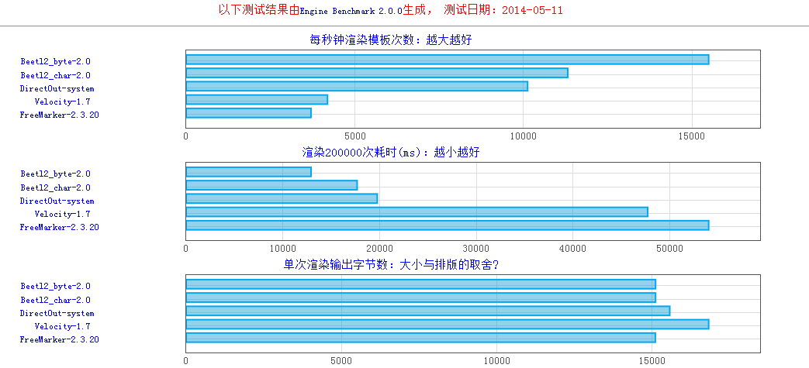

Engine Benchmark
===
<pre>
目前网络上的Java模板引擎测试基本上都是非独立JVM测试的，
这样做后测试的引擎性能会较高，与实际性能相比有较大偏差，
因此本测试对每个引擎都使用独立JVM测试，保证了各个引擎间环境的公平性；
</pre>

使用
===
###1.编译
<pre>
mvn clean install
</pre>

###2.修改参数
+ /target/classes/benchmark.bat
+ /target/classes/benchmark.properties

###3.运行
+ Windows 下执行
<pre>
/target/classes/benchmark.bat
</pre>
+ Linux暂未支持

测试结果：
============

~~~~~
JVM: windows oracle-JDK7u45 (64位)
JVM参数: -server -Xms128m -XX:PermSize=32m
预热: 3000
渲染次数: 500000
数据深度: 50
输出编码: UTF-8
~~~~~

~~~~~
JVM: windows oracle-JDK6u37 (32位)
~~~~~

参考资料
===
<pre>
交流QQ群：276400776

